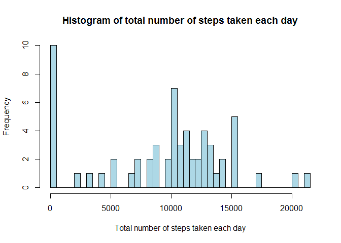
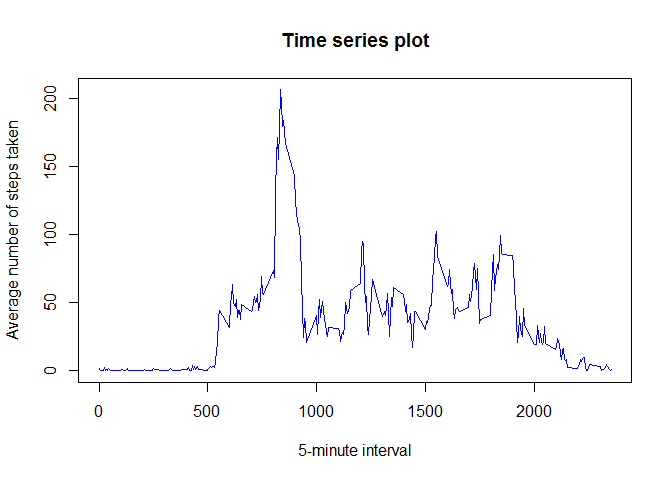
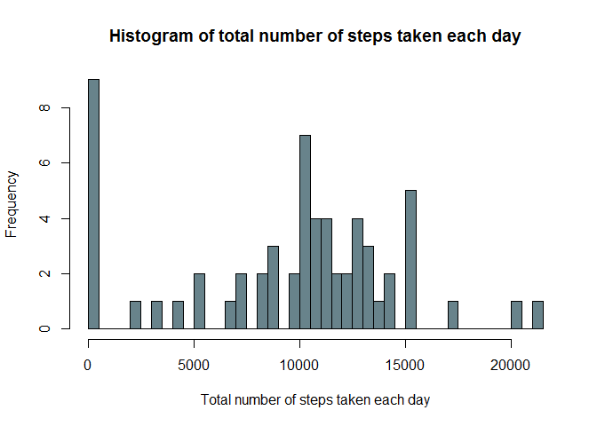
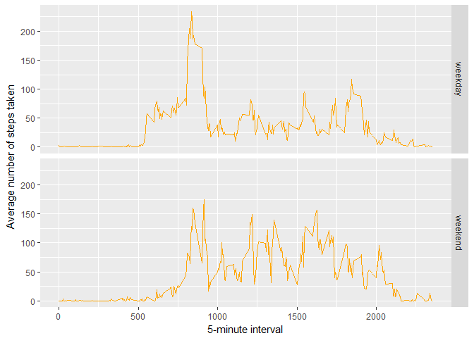

# Reproducible Research: Course Project 1
19 avril 2017  


## Loading and preprocessing the data

#### 1. Load the data (i.e. read.csv())
  


```r
url <- "https://d396qusza40orc.cloudfront.net/repdata%2Fdata%2Factivity.zip"
download.file(url, "activity_monitoring_data.zip")
unzip("activity_monitoring_data.zip")
activity <- read.csv("activity.csv",
                     stringsAsFactors = FALSE)
```

#### 2. Process/transform the data into a format suitable for the analysis

I load the libraries to transform the date.  
  


```r
library(lubridate)
library(dplyr)
library(tidyr)
```
  
  
Here I'll split the date into date parts (year, month, day) for easier processing. 


```r
activity <- activity %>% separate(date, c('year','month', 'day'), remove = F)
```

## What is mean total number of steps taken per day?

For this part of the assignment, I don't ignore the missing values in the dataset.  
  

#### 1. Calculate the total number of steps taken per day  
  
  


```r
num_steps_by_day <- activity %>%
  group_by(date)%>%
  summarise(sum_of_steps = sum(steps, na.rm = TRUE))

head(num_steps_by_day, n=3)
```

```
## # A tibble: 3 × 2
##         date sum_of_steps
##        <chr>        <int>
## 1 2012-10-01            0
## 2 2012-10-02          126
## 3 2012-10-03        11352
```

#### 2. Make a histogram of the total number of steps taken each day
  
  

```r
hist(num_steps_by_day$sum_of_steps, 
              main = "Histogram of total number of steps taken each day", 
              col = 'lightblue', 
              xlab = "Total number of steps taken each day",
              nclass=35)
```

<!-- -->
  
  
#### 3. Calculate and report the mean and median of the total number of steps taken per day


```r
mean_steps_per_day<-mean(num_steps_by_day$sum_of_steps, na.rm=TRUE)
median_steps_per_day<-median(num_steps_by_day$sum_of_steps, na.rm = TRUE)
```
> The mean of the total number of steps taken per day is 9354.2

> The median of the total number of steps taken per day is 10395


## What is the average daily activity pattern?

#### 1. Make a time series plot (i.e. type = "l") of the 5-minute interval (x-axis) and the average number of steps taken, averaged across all days (y-axis)


```r
avg_steps_per_interval <- activity %>%
  group_by(interval)%>%
  summarise(avg_steps = mean(steps, na.rm = T))

plot(x= avg_steps_per_interval$interval, y = avg_steps_per_interval$avg_steps, 
       type = 'l', col="blue", lwd=1,
       main = "Time series plot",
       xlab = "5-minute interval",
       ylab="Average number of steps taken")
```

<!-- -->

#### 2. Which 5-minute interval, on average across all the days in the dataset, contains the maximum number of steps?


```r
max_steps <- avg_steps_per_interval$interval[which.max(avg_steps_per_interval$avg_steps)]
```

> The 5-minute interval that contains the maximum number of steps is 835

## Imputing missing values

There are a number of days/intervals where there are missing values (coded as NA).   
The presence of missing days may introduce bias into some calculations or summaries of the data.  

#### 1. Calculate and report the total number of missing values in the dataset (i.e. the total number of rows with NAs)

```r
nb_nas <- length(which(is.na(activity)))
nb_nas
```

```
## [1] 2304
```

```r
apply(activity, MARGIN = 2, FUN = function(x){length(which(is.na(x)))})
```

```
##    steps     date     year    month      day interval 
##     2304        0        0        0        0        0
```
> The total number of rows with NAs is 2304

#### 2. Devise a strategy for filling in all of the missing values in the dataset.
The missing values in the dataset will be replaced by the mean for that 5-minute interval (using avg_steps_per_interval).

#### 3. Create a new dataset that is equal to the original dataset but with the missing data filled in.

```r
imputed_activity <- activity %>%
  mutate(steps = ifelse(is.na(steps),
                              avg_steps_per_interval$avg_steps[which(avg_steps_per_interval$interval
                                                                     == interval)], steps))
```

#### 4. Make a histogram of the total number of steps taken each day and Calculate and report the mean and median total number of steps taken per day. 
Do these values differ from the estimates from the first part of the assignment?  

What is the impact of imputing missing data on the estimates of the total daily number of steps?  


```r
imputed_num_steps_by_day <- imputed_activity %>%
  group_by(date)%>%
  summarise(sum_of_steps = sum(steps, na.rm = TRUE))

hist(imputed_num_steps_by_day$sum_of_steps, 
              main = "Histogram of total number of steps taken each day", 
              col = 'lightblue4', 
              xlab = "Total number of steps taken each day",
              nclass=35)
```

<!-- -->

```r
imputed_mean_steps_per_day <- mean(imputed_num_steps_by_day$sum_of_steps, na.rm=TRUE)
imputed_median_steps_per_day <- median(imputed_num_steps_by_day$sum_of_steps, na.rm=TRUE)
```

The mean of the total number of steps taken per day is 9530.72 vs 9354.23 with no imputation

The median of the total number of steps taken per day is 10439 vs 10395 with no imputation

> Mean imputation increases the estimate of the total daily number of steps

## Are there differences in activity patterns between weekdays and weekends?

#### 1. Create a new factor variable in the dataset with two levels - "weekday" and "weekend" indicating whether a given date is a weekday or weekend day.

For this question, I'll use the `lubridate::wday()` function to retrieve the day. `weekdays()` output may vary depending on the locale in use on the system.


```r
imputed_activity <- imputed_activity %>% 
  mutate(type_of_day = as.factor(ifelse(wday(date)%in%c(1,7),  'weekend', 'weekday')))

head(imputed_activity,3)
```

```
##       steps       date year month day interval type_of_day
## 1 1.7169811 2012-10-01 2012    10  01        0     weekday
## 2 0.3396226 2012-10-01 2012    10  01        5     weekday
## 3 0.1320755 2012-10-01 2012    10  01       10     weekday
```

#### 2. Make a panel plot containing a time series plot (i.e. type = "l") of the 5-minute interval (x-axis) and the average number of steps taken, averaged across all weekday days or weekend days (y-axis). 


```r
library(ggplot2)

avg_steps_per_interval <- imputed_activity %>%
  group_by(interval,type_of_day )%>%
  summarise(avg_steps = mean(steps, na.rm = TRUE))


ggplot(data = avg_steps_per_interval)+
  geom_line(aes(x = interval, y = avg_steps), col = 'orange')+
  facet_grid(type_of_day~.)+
  ylab("Average number of steps taken")+
  xlab("5-minute interval")
```

<!-- -->

